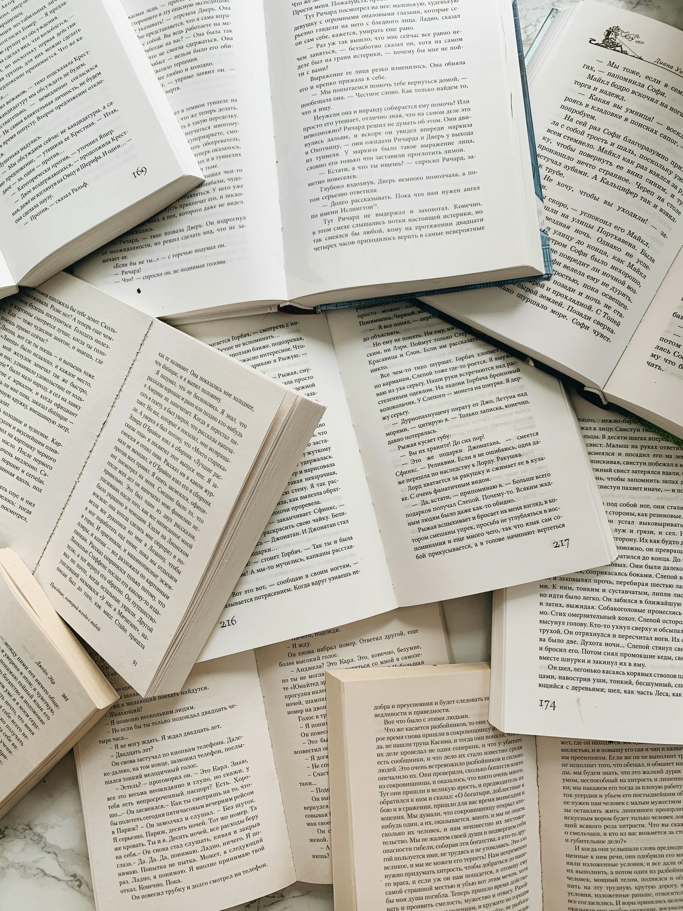
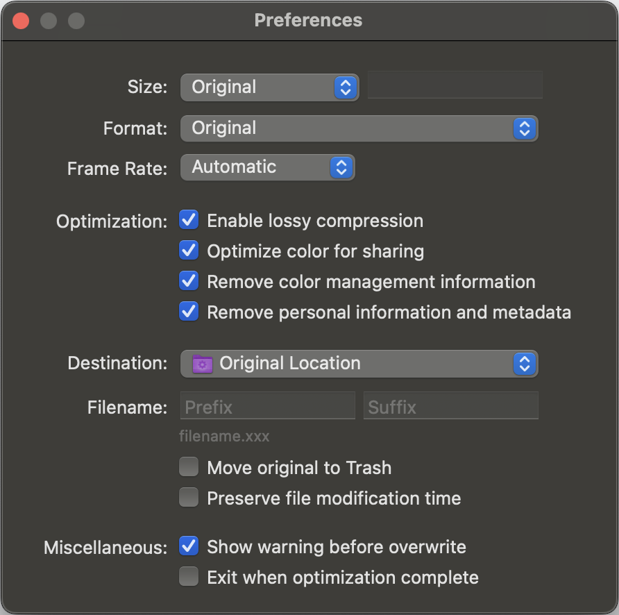

# rs-image-compressor Benchmark

## 風景写真

空、山、海など、色の変化が緩やかな部分と、木々や草など、細かいディテールが多い部分の両方を含むものが適しています。

`images/original/01.jpg`
※ [link](https://unsplash.com/ja/写真/2人のサイクリストが風光明媚な景色を眺めることができます-KxXdo-k1cjE)

|     | Original                    | rs-image-compressor                    | Optimage                    |
|-----|-----------------------------|----------------------------------------|-----------------------------|
| サイズ | 1,829,050 bytes             | 879,684 bytes                          | 1,445,615 bytes             |
| 画像  |  |  |  |

## ポートレート写真

人物の顔の肌の質感、髪の毛のディテールなどが重要になります。

`images/original/02.jpg`
※ [link](https://unsplash.com/ja/写真/バルコニーの近くに立つ男性-5aGUyCW_PJw)

|     | Original                    | rs-image-compressor                    | Optimage                    |
|-----|-----------------------------|----------------------------------------|-----------------------------|
| サイズ | 3,573,153 bytes             | 1,455,847 bytes                        | 2,454,192 bytes             |
| 画像  |  |  |  |

## テキスト画像

文字の鮮明さが重要になります。

`images/original/03.jpg`
※ [link](https://unsplash.com/ja/写真/白いテーブルに白いプリンター用紙-gETBUi_oRgQ)

|     | Original                    | rs-image-compressor                    | Optimage                    |
|-----|-----------------------------|----------------------------------------|-----------------------------|
| サイズ | 2,738,405 bytes             | 1,313,079 bytes                        | 2,099,541 bytes             |
| 画像  |  |  |  |

## グラデーション画像

色の滑らかな変化をどれだけ保持できるかが評価できます。

`images/original/04.jpg`
※ [link](https://unsplash.com/ja/写真/青と白の抽象画-J6LMHbdW1k8)

|     | Original                    | rs-image-compressor                    | Optimage                    |
|-----|-----------------------------|----------------------------------------|-----------------------------|
| サイズ | 623,448 bytes               | 137,648 bytes                          | 220,712 bytes               |
| 画像  |  |  |  |

## パターン画像

規則的なパターンがどれだけ効率的に圧縮できるか評価できます

`images/original/05.jpg`
※ [link](https://unsplash.com/ja/写真/たくさんの木々のある森の空撮-MUtNG8GurSQ)

|     | Original                    | rs-image-compressor                    | Optimage                    |
|-----|-----------------------------|----------------------------------------|-----------------------------|
| サイズ | 3,164,900 bytes             | 1,787,138 bytes                        | 3,153,909 bytes             |
| 画像  |  |  |  |

---

## Preferences

### rs-image-compressor

[configure.json](images/rs-image-compressor/configure.json)

### Optimage

